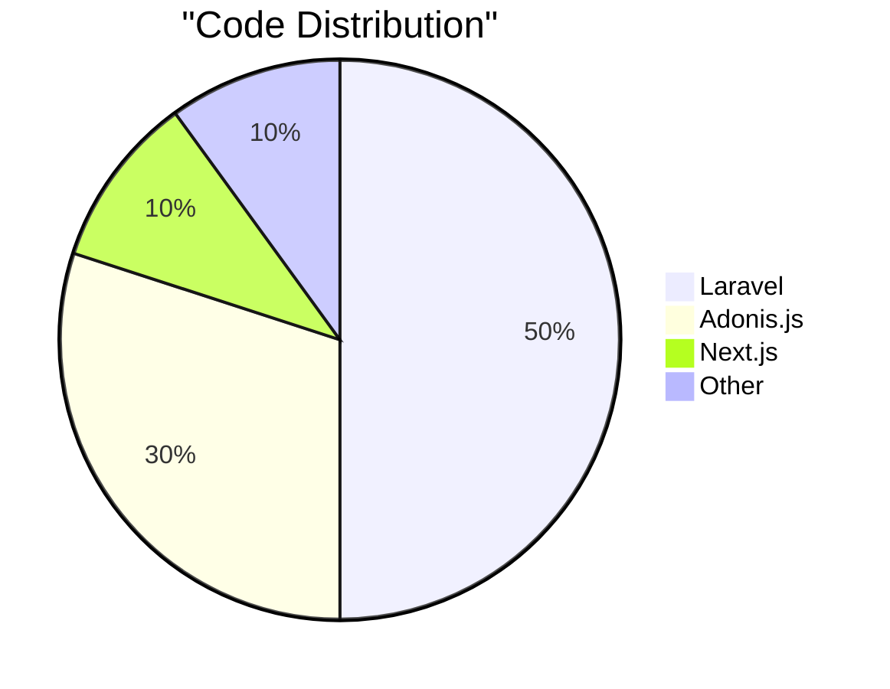

# 👋 Hi, I'm Mitesh Viras

## 💻 Full Stack Developer | 5+ Years Experience | Now Exploring Agentic AI & Workflow Automation

[](https://linkedin.com/in/mitesh-viras)
[](https://x.com/mitesh_viras)
[](mailto:virashmitesh@gmail.com)
[](https://miteshviras.vercel.app)

Passionate Full Stack Developer with **5+ years of experience** building clean, scalable web applications. Specialized in **Laravel** and **Adonis.js**, with a strong backend focus and a growing interest in **Agentic AI** and **intelligent workflow automation**.

---

### 🧭 Current Focus

```
🤖 Agentic AI        — Building AI agents that think, plan, and act autonomously
⚙️ Workflow Automation — Designing intelligent pipelines and multi-step automations
🔁 LLM Integration   — Embedding AI capabilities into real-world backend systems
🧩 MCP & Tool Use    — Exploring Model Context Protocol for agent-tool orchestration
```

---

### 🏢 Work Experience

| Period | Role | Company |
|--------|------|---------|
| 2025 – Present | **Sr. Backend Developer** | Freelancing & Private Contracts |
| 2024 – 2025 | **Backend Developer** | Kalkani System Pvt. Ltd. |
| 2021 – 2024 | **Web Developer** | Appstonelab LLP |

> At my current role, I'm maintaining and migrating legacy PHP (Kohana) systems to Laravel, upgrading to the latest PHP version, and managing multiple micro-apps.

---

### 🚀 Project Portfolio Overview

📊 **Delivery Stats:**
- **11+ Projects Delivered** from scratch
- **5 Ongoing Projects**

🛠️ **Tech Stack Breakdown:**
- 7 Laravel Projects
- 4 Adonis.js Projects
- 1 Next.js Frontend Project
- 4 Others

---

### 🏆 Notable Projects

| Project | Stack | Link |
|---------|-------|------|
| Saibaba Tours | Laravel | [saibabatours.com](https://saibabatours.com) |
| 4PS Energy Consultant | Laravel | [4psenergyconsultant.com](https://4psenergyconsultant.com) |
| Iplex Infotech | Laravel | [iplexinfotech.com](https://iplexinfotech.com) |
| Bhole G Namkeen | Next.js + Express | [bholegnamkeen.com](https://bholegnamkeen.com) |
| Digital Restro | Laravel + Livewire | Private Product |
| Streamline Transportation | Laravel + Next.js | Private – US Logistics Firm |
| TheBuilder | — | Private |

> 📌 Several projects are under NDA and cannot be disclosed publicly.

---

### 💡 Technical Expertise

```
Backend          Frontend         DevOps          Tools & More
────────         ────────         ───────         ────────────
Laravel          React            Docker          Git
Adonis.js        Next.js          CI/CD           VS Code
PHP              Tailwind CSS     AWS             Postman
Node.js          JavaScript       PostgreSQL      RESTful APIs
Nest.js          TypeScript       MongoDB         Filament
Kohana (legacy)  Livewire                         MCP / AI Agents
```

---

### 📈 GitHub Activity

<div align="center">

[](https://git.io/streak-stats)

</div>


```mermaid
pie
    title "Code Distribution"
    "Laravel" : 50
    "Adonis.js" : 30
    "Next.js" : 10
    "Other" : 10
```

---

### 🎯 Weekly Coding Breakdown

```
Monday      ▓▓▓▓▓▓▓▓▓▓▓▓▓▓▓▓▓▓▓░░░  80%
Tuesday     ▓▓▓▓▓▓▓▓▓▓▓▓▓▓▓▓░░░░░░  70%
Wednesday   ▓▓▓▓▓▓▓▓▓▓▓▓▓▓▓▓▓▓░░░░  75%
Thursday    ▓▓▓▓▓▓▓▓▓▓▓▓▓▓▓▓▓▓▓▓░░  85%
Friday      ▓▓▓▓▓▓▓▓▓▓▓▓▓▓▓▓▓░░░░░  72%
Saturday    ▓▓▓▓▓▓▓▓▓▓▓▓░░░░░░░░░░  55%
Sunday      ▓▓▓▓▓▓░░░░░░░░░░░░░░░░  30%
```

---

### 🤝 Let's Connect!

- 📧 Email: [virashmitesh@gmail.com](mailto:virashmitesh@gmail.com)
- 🔗 LinkedIn: [linkedin.com/in/mitesh-viras](https://linkedin.com/in/mitesh-viras)
- 🌐 Portfolio: [miteshviras.vercel.app](https://miteshviras.vercel.app)
- 🐦 X/Twitter: [@mitesh_viras](https://x.com/mitesh_viras)

---

<div align="center">


[](https://github.com/miteshviras)

</div>
